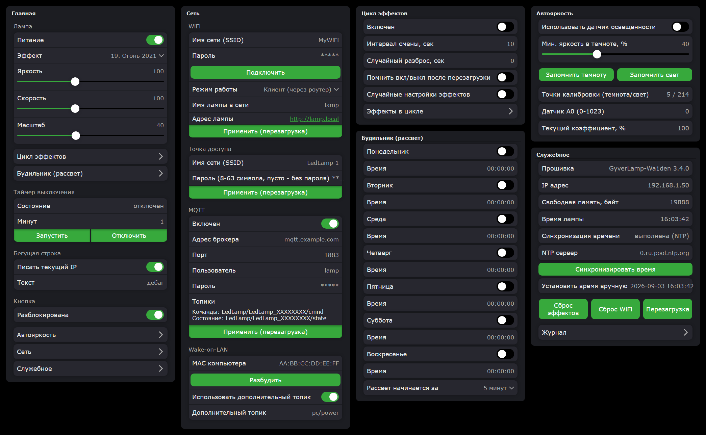

# GyverLamp-Wa1den

Версия 3.2.0. Прошивка от Wa1den, основана на [Gunner47 v2.87in1](https://github.com/SottNick/GyverLamp),
которая, в свою очередь, основана на [GyverLamp](https://github.com/AlexGyver/GyverLamp/) от AlexGyver.

## Что это

Прошивка для настольной WiFi-лампы: адресная лента WS2812B, свёрнутая матрицей 16×16
в цилиндр, и плата Wemos D1 mini (ESP8266) в основании. Лампа показывает 90 анимированных
эффектов, работает будильником с имитацией рассвета и управляется тремя способами:
со страницы настроек в браузере, по MQTT и сенсорной кнопкой на корпусе. Мобильное
приложение не требуется.

Схемы, корпус и порядок сборки самой лампы описаны в [проекте AlexGyver](https://alexgyver.ru/GyverLamp/).



## Возможности

**Эффекты.** 90 режимов: 87 унаследованы от прошивки Gunner47 без изменений, три написаны
под форм-фактор цилиндра.

- **Змейка** (87) — игра со змейкой: змейка движется к еде и растёт, по горизонтали проходит через
  стык цилиндра, длина пути рассчитывается с учётом заворота. Бегунок Масштаб задаёт цвет.
- **Земля** (88) — вращающаяся карта планеты. При синхронизированном времени ночная сторона
  затемняется по текущему положению Солнца.
- **Марио** (89) — мини-платформер. Персонаж бежит на месте, мир движется навстречу,
  препятствия приходят по одному: пара кирпичей в воздухе или враг на земле. Бегунок
  Скорость задаёт темп движения мира, Масштаб — колонку, на которой стоит персонаж.

У каждого эффекта своя яркость, скорость и масштаб, значения сохраняются между
переключениями.

**Веб-интерфейс.** Страница настроек открывается в браузере по адресу лампы, а в режиме
точки доступа — на `http://192.168.4.1`. На главной странице то, что нужно каждый день:
питание, выбор эффекта из нумерованного списка, ползунки яркости, скорости и масштаба,
таймер выключения, бегущая строка и кнопка. Остальное убрано в разделы, каждый открывается
отдельной страницей: «Цикл эффектов», «Будильник», «Автояркость», «Сеть» (WiFi, точка
доступа, MQTT, Wake-on-LAN) и «Служебное» (информация, время, Журнал, сбросы). Открытая
страница обновляет свои виджеты, если лампой управляют другим способом.

**Журнал и диагностика.** Раздел «Служебное» → «Журнал» показывает, что происходило с лампой:
причину последней перезагрузки, подключение к WiFi и брокеру, синхронизацию времени, ошибки.
Туда же попадают подвисания: если какая-то стадия основного цикла заняла больше
`LOOP_WATCHDOG_MS`, в журнал пишется её имя, длительность и состояние кучи (свободно всего,
самый большой непрерывный блок, процент фрагментации), а стадию веб-интерфейса дополнительно
разбирает построчное профилирование с порогом `UI_PROFILE_MS` — оба порога в
[`Config.h`](Config.h), любой можно закомментировать.

**Имя лампы в сети.** По этому имени лампа отвечает по mDNS на `http://имя.local`, и под ним
же она записана у роутера, поэтому её адрес не нужно искать в списке клиентов. Имя задаётся
на странице настроек, начальное значение — `lamp` из [`Config.h`](Config.h), и у каждой
лампы в сети оно должно быть своё. Имена `.local` разрешают Windows 10 и новее, macOS, iOS и
Android 12 и новее; на остальных устройствах остаётся адрес по IP.

**Точка доступа.** Имя и пароль собственной сети лампы задаются на странице настроек, значения
из [`Config.h`](Config.h) используются как начальные. Пароль короче восьми символов WiFi не
принимает, пустое поле означает сеть без пароля. Новые значения применяются перезагрузкой;
кнопка «Сброс WiFi» и переключение режима работы семикратным кликом возвращают имя и пароль
из `Config.h` — на случай, если пароль точки доступа забыт и страница настроек недоступна.

**Режим Цикл.** Автоматическое переключение эффектов: интервал, случайный разброс интервала,
случайные настройки эффектов и выбор участвующих эффектов чек-листом.

**Будильник-рассвет.** Отдельное время на каждый день недели. Рассвет начинается за
5-60 минут до заданного времени, интервал выбирается в настройках, яркость нарастает плавно.

**Таймер выключения.** Задаётся со страницы настроек, по MQTT или двойным кликом кнопки
на выключенной лампе — в последнем случае берётся время, использованное в прошлый раз.

**Бегущая строка.** Отдельный эффект, текст задаётся на странице настроек. Там же есть
галка «Писать текущий IP»: вместо заданного текста строка показывает адрес лампы. Адрес
считывается при каждом запуске эффекта, поэтому после того, как роутер выдал лампе новый
адрес, достаточно включить бегущую строку. Поле «Текст» галка не изменяет: после её снятия
возвращается заданный текст.

**MQTT и Яндекс Алиса.** Управление через любой брокер, например wqtt.ru. Формат топиков
совместим с прошивками 2.x, дополнительно есть отдельные топики power, brightness и speed
для привязки к умному устройству в Алисе. Протокол описан [ниже](#mqtt).

**Автояркость.** Опциональная регулировка по датчику освещённости на входе A0: в темноте
яркость плавно снижается до настраиваемого минимума. По умолчанию функция выключена,
и без датчика прошивка работает так же. Калибровка двухточечная, кнопками «Запомнить
темноту» и «Запомнить свет»; текущее показание датчика видно на странице настроек.

**Wake-on-LAN.** Отправка magic packet на MAC-адрес компьютера в локальной сети — кнопкой
на странице настроек или командой MQTT. Дополнительно можно указать произвольный топик,
по сообщению в который выполняется то же действие.

**Обновление по воздуху.** Прошивка загружается со страницы настроек, файл `.bin` берётся
из [релизов](https://github.com/Wa1den/GyverLamp-Wa1den/releases). Настройки при обновлении
сохраняются.

**Обновление из Arduino IDE.** Второй способ прошивки, без файла `.bin`: четыре клика кнопкой,
повторённые в течение 30 секунд, переводят лампу в режим сетевой прошивки — включается эффект
«Матрица», и на 5 минут открывается порт 8266. Лампа появляется в Arduino IDE в списке
Инструменты → Порт как сетевой порт, дальше обычная «Загрузка», пароль — `AP_PASS` из
[`Config.h`](Config.h), пароль точки доступа со страницы настроек на него не влияет. Компьютер
должен быть в одной сети с лампой: в режиме точки доступа достаточно подключиться к её сети.
Способ рассчитан на разработку, когда прошивка собирается в IDE и промежуточный файл
выкладывать незачем.

**Кнопка.** Сенсорная кнопка на корпусе, набор жестов унаследован от прошивки Gunner47.

| Жест | Действие |
|---|---|
| 1 клик | включение и выключение |
| 2 клика | следующий эффект; на выключенной лампе — включение с таймером сна |
| 3 клика | предыдущий эффект |
| 4 клика | переход в режим обновления по воздуху |
| 5 кликов | показ IP-адреса бегущей строкой |
| 6 кликов | показ текущего времени |
| 7 кликов | переключение между режимами точки доступа и клиента WiFi |
| удержание | регулировка яркости; на выключенной лампе включает белый свет |
| клик и удержание | регулировка скорости |
| два клика и удержание | регулировка масштаба |

## Железо

| Что | Значение |
|---|---|
| Плата | Wemos D1 mini (ESP8266), flash 4 МБ |
| Матрица | 16×16, WS2812B, тип «зигзаг», подключение из левого нижнего угла |
| Пин ленты | D4 (GPIO2) |
| Пин кнопки | D2 (GPIO4) |
| Датчик освещённости | A0, опционально |
| Лимит тока | 2000 мА, регулируется автоматическим снижением яркости |

Размеры матрицы, распиновка, тип разводки и лимит тока задаются в [`Config.h`](Config.h).
Поведение прошивки — в [`Constants.h`](Constants.h).

## Сборка

Папка со скетчем должна называться `GyverLamp-Wa1den`: Arduino требует совпадения имени
папки с именем главного `.ino`. При клонировании репозитория так и получается.

**Ядро**: esp8266 3.1.2 или новее, адрес для менеджера плат
`https://arduino.esp8266.com/stable/package_esp8266com_index.json`, плата
LOLIN(WEMOS) D1 R2 & mini.

**Настройки IDE**:

- Flash Size: 4MB (FS:2MB OTA:~1019KB), файловая система обязательна;
- Erase Flash: All Flash Contents для первой прошивки, далее Only Sketch, иначе настройки
  будут стираться при каждой загрузке;
- остальное по умолчанию, частоты 80 МГц достаточно.

**Библиотеки** проверенных версий лежат в папке `libs`. Скопируйте её содержимое в папку
библиотек Arduino (`Документы/Arduino/libraries`).

| Библиотека | Версия | Назначение |
|---|---|---|
| FastLED | 3.2.9 | математика эффектов |
| NeoPixelBus (Makuna) | строго 2.8.4 | вывод на ленту через UART1, master не собирается под ядро 3.x |
| Settings (GyverLibs) | 1.4.3 из папки `libs` | веб-интерфейс настроек. Добавлен `core/profile.h` и вызовы замеров: библиотека сообщает скетчу длительность каждого этапа обработки запроса страницы (см. `UI_PROFILE_MS` в [`Config.h`](Config.h)). Без правки в Журнале видно только суммарное время стадии «веб-интерфейс» |
| GyverDB, GyverHTTP, StringUtils, GTL, BSON, Stamp, Table, StreamIO, FOR_MACRO (GyverLibs) | из папки `libs` | зависимости Settings и GyverDB. Версии связанные: Settings 1.4.3 требует BSON 3.0.0 (новые методы записи значений), а тот - GTL 1.4.7. Брать из `libs` целиком, а не по одной. В GyverHTTP внесена правка на одну строку (`#ifndef` вокруг таймаута клиента), позволяющая прошивке сократить время блокировки лампы синхронным вебсервером. С неизменённой версией лампа подвисает при открытии страницы настроек |
| WiFiConnector (GyverLibs) | свежая | подключение к WiFi |
| GyverButton (GyverLibs) | свежая | кнопка |
| WebSockets (Links2004) | из папки `libs` | обновление виджетов открытой страницы. Штатно все ожидания TCP брали общий таймаут 5000 мс, и каждое из них останавливало весь скетч на эти 5 секунд. Разнесены по стадиям и укорочены: рукопожатие 700, дочитывание кадра 1100, отправка 1500 мс (`WebSockets.h`). Значения намеренно разные — по длительности провала в Журнале видно, какая стадия его вызвала |
| AsyncMqttClient + ESPAsyncTCP | свежие | MQTT |
| NTPClient, Time (TimeLib), Timezone | свежие | время и будильники |

**Первый запуск.** При обновлении с прошивки 2.x настройки сбрасываются, поскольку формат
хранения изменился. Нужно один раз подключиться к точке доступа `LedLamp 1` с паролем
`31415926` и указать параметры WiFi на `http://192.168.4.1`.

## MQTT

Идентификатор лампы — `LedLamp_XXXXXXXX`, где `XXXXXXXX` это chip id. Готовые топики
показаны на странице настроек в разделе «Сеть» → «MQTT». Адрес брокера, порт, логин и пароль задаются
там же; пока адрес брокера пустой, MQTT-клиент не запускается.

**Команды** (входящие):

| Топик | Payload |
|---|---|
| `LedLamp/<id>/cmnd/power` | `true`/`1`/`on` включает, любое другое значение выключает |
| `LedLamp/<id>/cmnd/effect` | номер эффекта `0..89` |
| `LedLamp/<id>/cmnd/brightness` | `1-100`, масштабируется в `1-255`; значения больше 100 передаются как есть |
| `LedLamp/<id>/cmnd/speed` | `1-100`, масштабируется в `1-255`; значения больше 100 передаются как есть |
| `LedLamp/<id>/cmnd/scale` | масштаб, как есть |
| `LedLamp/<id>/cmnd/button` | `true`/`1`/`on` разблокирует кнопку, любое другое значение блокирует |
| `LedLamp/<id>/cmnd/wol` | MAC компьютера (`AA:BB:CC:DD:EE:FF`), либо пусто/`true`/`1`/`on` для MAC из настроек. `false`/`0`/`off` игнорируется |
| `LedLamp/<id>/cmnd` | текстовые команды, формат совместим с прошивками 2.x (см. таблицу ниже) |

Текстовые команды топика `cmnd`:

| Команда | Действие |
|---|---|
| `P_ON`, `P_OFF` | питание |
| `EFFn` | эффект с номером `n` |
| `BRIn`, `SPDn`, `SCAn` | яркость, скорость, масштаб |
| `BTN ON`, `BTN OFF` | блокировка кнопки |
| `TEXT текст` | текст бегущей строки |
| `ALM_SETd ON\|OFF\|минуты` | будильник дня `d` (1-7): включение, выключение или время в минутах от начала суток |
| `DAWNn` | длительность рассвета, номер опции в списке |
| `TMR_SET вкл опция секунды` | таймер выключения, например `TMR_SET 1 3 300`. `TMR_SET 0` отключает |
| `FAV_SET ...` | настройки режима Цикл, формат см. в `FavoritesManager.h` |
| `WOL [MAC]` | Wake-on-LAN |

Команда смены эффекта (`EFFn` или топик `effect`) на выключенной лампе также включает её.

**Состояние** (исходящее, retained, публикуется после каждого изменения):

```
LedLamp/<id>/state
{"effect":5,"brightness":42,"speed":60,"scale":40,"power":true,"espMode":1,
 "useNtp":true,"timerRunning":false,"buttonEnabled":true,"time":"21:25:50",
 "ip":"192.168.1.42"}
```

Поле `ip` содержит текущий адрес лампы, в режиме точки доступа — адрес AP. Топик retained,
поэтому актуальный адрес доступен в любой момент, в том числе после смены адреса роутером.

Яркость и скорость публикуются в диапазоне 1-100, что позволяет напрямую привязать их
к яркости умного устройства в Алисе.

## Версии

Имя и номер версии задаются в [`Version.h`](Version.h) и отображаются на странице настроек:
в инфо-панели (строка Firmware) и в разделе «Служебное». Схема нумерации — `МАЖОР.МИНОР.ПАТЧ`:

- МАЖОР — несовместимые изменения: сброс настроек, смена протокола или требований к железу;
- МИНОР — новые эффекты и функции, настройки переживают обновление;
- ПАТЧ — исправления ошибок.

Каждому выпуску соответствует git-тег `vX.Y.Z` и релиз на GitHub с собранным `.bin`
для обновления по воздуху.

## Отличия от прошивки Gunner47 v2.87in1

Аппаратная совместимость полная: та же плата, та же распиновка, тот же порядок цветов.
Сами эффекты не изменялись.

**Веб-интерфейс вместо мобильных приложений.** Поддержка Android/iOS-приложений и Blynk убрана:
приложения устарели и на последних версиях Android не устанавливаются. Вместо них
используется библиотека [GyverLibs/Settings](https://github.com/GyverLibs/Settings),
страница настроек открывается в браузере. Все параметры, которые раньше требовали
перепрошивки, включая SSID, пароль WiFi, брокер MQTT и адрес NTP-сервера, редактируются
со страницы.

**Хранение настроек.** Вместо записи в сырой EEPROM используется файл на LittleFS
(библиотека GyverDB).

**Подключение к WiFi.** Библиотека WiFiConnector вместо WiFiManager. При недоступном
роутере лампа остаётся точкой доступа с работающей страницей настроек, а не уходит
в цикл перезагрузок.

**Вывод кадров на ленту.** Аппаратный UART1 через NeoPixelBus вместо программного
формирования сигнала средствами FastLED (bit-banging), пин тот же (D4/GPIO2), перепайка не требуется. Это устраняет
искажение первого пикселя: WiFi на ESP8266 использует немаскируемые прерывания, поэтому
программный вывод портит кадры при любых настройках `FASTLED_ALLOW_INTERRUPTS`
и `FASTLED_INTERRUPT_RETRY_COUNT`. FastLED используется для расчёта эффектов.

**Единый слой команд.** Веб-страница, MQTT и кнопка вызывают одни и те же функции
(`LampControl.ino`) вместо разбора строковых команд в нескольких местах.

**Добавлено:** три эффекта (Змейка, Земля, Марио), автояркость по датчику освещённости,
Wake-on-LAN, поле `ip` в MQTT-состоянии и опция «Писать текущий IP» в бегущей строке.

**Удалено:** `parsing.ino` (UDP-протокол приложения), `blynk.ino`, `EepromManager.h`,
`CaptivePortalManager.h` и режим рисования по пикселям, доступный только из приложения.
