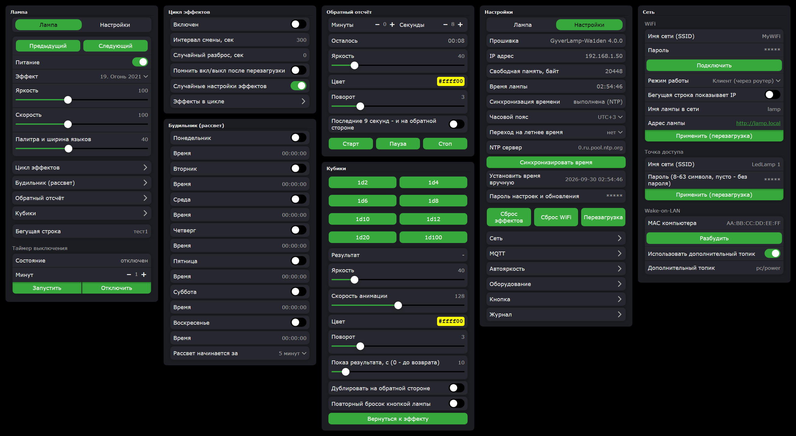

# GyverLamp-Wa1den

Прошивка для настольной WiFi-лампы: адресная лента WS2812B, свёрнутая матрицей 16×16 в
цилиндр, и плата Wemos D1 mini (ESP8266) в основании. Основана на
[Gunner47 v2.87in1](https://github.com/SottNick/GyverLamp), которая, в свою очередь, основана
на [GyverLamp](https://github.com/AlexGyver/GyverLamp/) от AlexGyver. Схемы, корпус и порядок
сборки самой лампы описаны в [проекте AlexGyver](https://alexgyver.ru/GyverLamp/).

Лампа управляется со страницы в браузере, по MQTT и кнопкой на корпусе. Мобильное приложение
не нужно.



## Возможности

- **92 эффекта.** Большая часть унаследована от Gunner47, четыре сделаны под цилиндр: Змейка,
  вращающаяся Земля с ночной стороной по текущему времени, платформер Марио и Пинг-понг. У
  каждого эффекта свои яркость, скорость и масштаб, подписи ползунков зависят от эффекта.
- **Кадры с компьютера** по локальной сети, протоколом DDP на UDP-порту 4048: матрицей
  управляют [CaseLight](https://github.com/Wa1den/CaseLight) (плагин GyverLamp), Hyperion,
  LedFx, xLights. Приём включается в разделе «Сеть», после этого в списке появляется эффект
  «Кадры с компьютера» с ползунком поворота картинки. Без кадров дольше 2,5 с лампа гаснет.
  С автоматическим переключением первый кадр переводит лампу на этот эффект, а после заданного
  ожидания без кадров лампа возвращается к прежнему эффекту или выключается. Полностью чёрные
  кадры здесь не считаются: CaseLight шлёт их и при молчащем эквалайзере. Во втором случае
  кадры включают и выключенную лампу. Пока кадры идут, Цикл не переключает эффект.
- **Страница настроек** в браузере по адресу лампы или по имени `http://lamp.local`. На
  вкладке «Лампа» ежедневное управление, на вкладке «Настройки» сеть, MQTT, оборудование,
  кнопка и журнал. Вкладку «Настройки» и обновление прошивки можно закрыть паролем.
- **Цикл:** автоматическая смена выбранных эффектов с заданным интервалом.
- **Будильник-рассвет:** своё время на каждый день недели, яркость нарастает за 5–60 минут.
- **Таймер выключения** со страницы, по MQTT или жестом кнопки.
- **Обратный отсчёт** крупными цифрами со вспышками в последние секунды.
- **Кубики** от 1d2 до 1d100 с анимацией броска.
- **Бегущая строка** с заданным текстом или адресом лампы.
- **MQTT**, в том числе для управления из Яндекс Алисы через wqtt.ru.
- **Автояркость** по датчику освещённости, если он подключён.
- **Wake-on-LAN:** кнопка на странице или команда MQTT будит компьютер в локальной сети.
- **До пяти сетей WiFi:** лампа подключается к той из сохранённых, у которой сигнал лучше.
- **Обновление по воздуху** со страницы настроек, файл берётся из
  [релизов](https://github.com/Wa1den/GyverLamp-Wa1den/releases). Настройки сохраняются.
  Страница раз в сутки проверяет новые релизы и сообщает о них, проверку можно отключить.
- **Журнал** на странице: причина перезагрузки, подключения, синхронизация времени, зависания.

## Кнопка

Действие каждого жеста меняется на странице настроек, в разделе «Кнопка». По умолчанию:

| Жест | Действие |
|---|---|
| 1 клик | включение и выключение |
| 2 клика | следующий эффект; на выключенной лампе включение с таймером выключения |
| 3 клика | предыдущий эффект |
| 5 кликов | IP-адрес бегущей строкой |
| 6 кликов | текущее время бегущей строкой |
| удержание | яркость; на выключенной лампе включает белый свет |
| клик и удержание | скорость |
| 2 клика и удержание | масштаб |
| 4 клика и удержание | обновление из Arduino IDE |
| 7 кликов и удержание | смена режима WiFi: точка доступа или подключение к роутеру |

Переход из режима клиента в точку доступа сбрасывает сеть роутера, имя и пароль точки доступа
и пароль страницы. Так возвращается доступ к лампе, если пароль забыт.

## Железо

| Что | Значение |
|---|---|
| Плата | Wemos D1 mini (ESP8266), flash 4 МБ |
| Матрица | 16×16, WS2812B |
| Пин ленты | D4 (GPIO2) |
| Пин кнопки | D2 (GPIO4), сенсорная или механическая |
| Датчик освещённости | A0, необязательный |

До прошивки в [`Config.h`](Config.h) задаются только размеры матрицы и пины. Подключение
матрицы, порядок цветов, лимит тока и тип кнопки выставляются после прошивки на странице
настроек, в разделах «Оборудование» и «Кнопка».

## Сборка и прошивка

Нужен [arduino-cli](https://arduino.github.io/arduino-cli/):

```bash
./build.sh
```

Скрипт ставит ядро esp8266 3.1.2, собирает прошивку с библиотеками из папки
[`libs`](libs/README.md) и кладёт `.bin` в `dist`. Часть библиотек исправлена, правки описаны
там же.

Для Arduino IDE: папка скетча называется `GyverLamp-Wa1den`, плата LOLIN(WEMOS) D1 R2 & mini,
Flash Size 4MB (FS:2MB OTA:~1019KB), библиотеки из `libs` копируются в папку библиотек Arduino.

При первом запуске лампа поднимает точку доступа `LedLamp 1` с паролем `31415926`. Страница
настроек открывается на `http://192.168.4.1`, там указывается сеть роутера. При переходе с
прошивок 2.x настройки не переносятся.

## MQTT

Адрес брокера, логин и пароль задаются на странице настроек в разделе «MQTT», там же показаны
топики лампы. Идентификатор лампы `<id>` имеет вид `LedLamp_XXXXXXXX`.

| Топик | Значение |
|---|---|
| `LedLamp/<id>/cmnd/power` | `on`/`1`/`true` включает, остальное выключает |
| `LedLamp/<id>/cmnd/effect` | номер эффекта 0–90 |
| `LedLamp/<id>/cmnd/brightness`, `speed` | 1–100 |
| `LedLamp/<id>/cmnd/scale` | масштаб |
| `LedLamp/<id>/cmnd/button` | `on` разблокирует кнопку, остальное блокирует |
| `LedLamp/<id>/cmnd/wol` | MAC компьютера или пусто для MAC из настроек |
| `LedLamp/<id>/cmnd` | текстовые команды, совместимые с прошивками 2.x: `P_ON`, `P_OFF`, `EFFn`, `BRIn`, `SPDn`, `SCAn`, `TEXT текст`, `ALM_SETd ON\|OFF\|минуты`, `DAWNn`, `TMR_SET 1 0 секунды`, `TMR_SET 0`, `FAV_SET ...`, `WOL [MAC]` |
| `LedLamp/<id>/state` | состояние в JSON, retained: эффект, яркость, скорость, масштаб, питание, таймер, время, IP |

Яркость и скорость в MQTT идут в диапазоне 1–100, чтобы их можно было напрямую привязать к
умному устройству в Алисе.

## Отличия от Gunner47 v2.87in1

Плата, распиновка и эффекты те же. Мобильные приложения и Blynk заменены страницей настроек в
браузере: приложения на новых версиях Android не устанавливаются. Все параметры, которые раньше
требовали перепрошивки, меняются на странице. Настройки хранятся в файле на LittleFS, кадры
выводятся на ленту аппаратным UART1 без искажения первого пикселя, при недоступном роутере
лампа остаётся точкой доступа со страницей настроек. Добавлены четыре эффекта, обратный отсчёт,
кубики, автояркость, Wake-on-LAN и журнал.
